## Information
----
* IDE: Eclipse
* Java Version:14
* Packaging of source code: Actor, StartScene, Game, EndScene, World, resources, test
* All packages from above are inside the package p4_group_8_repo

## Maintanence
-----------
#### Refactoring
1. Extract Method
	 * Move code to a new method and replace the old code by calling the method. For examples, in Animal class, new methods like CarDeath(), WaterDeath(), setMoveImageSecond() and deathReset() are created; in some subclasses of Actor class like Digit and End, a method setImageXY() is created to set image, X, and Y for the class.
2. Replace Parameter with Method
	 * Use the get value method to call the parameter instead of just calling the parameter. For example, getPoints() in Animal class.
3. Encapsulate Fields
	 * Make the variables private and create methods for public access to those private variables. 
4. Rename Variable and Method
	 * Make a clear understanding of variables and methods.
5. Replace type code with polymorphism
	 * Use switch statement in Animal class and replace the type code with polymorphism by instantiating a new object and calling its method.
6. Single Responsibility with Extract Class
	 * All classes only do one thing. For example, EndScene class only controls with the information of end scene. 
7. Push Down/Pull Up Methods
	 * Pull up the methods that have the same composition. For example, a method setImageXY() is pulled up into Actor class.
	
#### MVC Pattern 
* The StartScene, Game, EndScene classes will be divided into model, controller and view that are connected to each other.
* For examples:
	 1. In StartScene class, StartSceneModel is added which is to set and get the objects from StartScene, StartSceneView which includes methods to set up the view of the starting scene for the game, and StartSceneController which is to control the buttons from the StartScene.
	 2. In Game class, GameModel is created to set and get the objects from Game class, and GameView is to set up the view for the game section including setting the digits into scene when points are changed or removing the game lives when the frog is dead, and GameController is to control the model and view for the game like when to set the digits.
	 3. In EndScene class, EndSceneModel is also created to set and get the objects, EndSceneView is to set up the view of the ending scene, and EndSceneController is to control the buttons from EndScene.

#### JUnit tests
* A class ActorImp is created for tetsing purpose and to avoid affecting the core functions for other classes
* Four JUnit Tests are added:
							 1. AnimalTest to test the points
							 2. FlyTest to test the starting values of the fields in Fly class
							 3. WorldTest to test the function of dealing with actors
							 4. ScoreListTest to test if the score is written and sorted probably

## Additions & Extensions
-----------
#### Game Background
* added a background for the game
* there was only white background at the back when first time running the game

#### Start Scene:
* it is the starting scene for the game which also the starting point for the codes (where to start run the code in StartScene class)
* Related Class Name: StartScene, StartSceneModel, StartSceneView, StartSceneController
* contains: 
			 1. basic info about the game
			 2. a text field to insert player name
			 3. two buttons: Start and How To Play 
 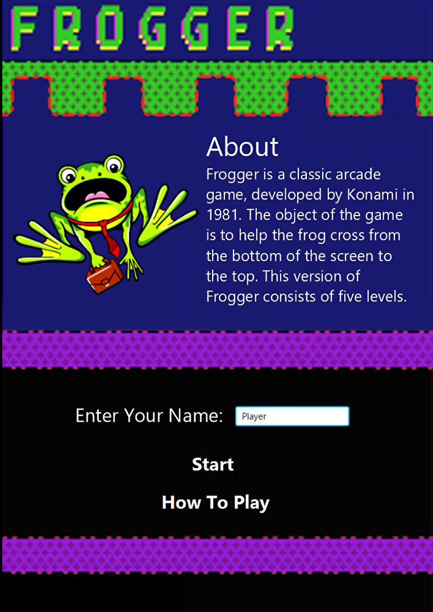

#### Instruction Scene
* it indicates the instruction of how to play the game
* the scene shows after the How To Play button from start scene is pressed 
* Related Class Name: Instruction, StartSceneModel, StartSceneView, StartSceneController
* contains: instruction and a Start button 
 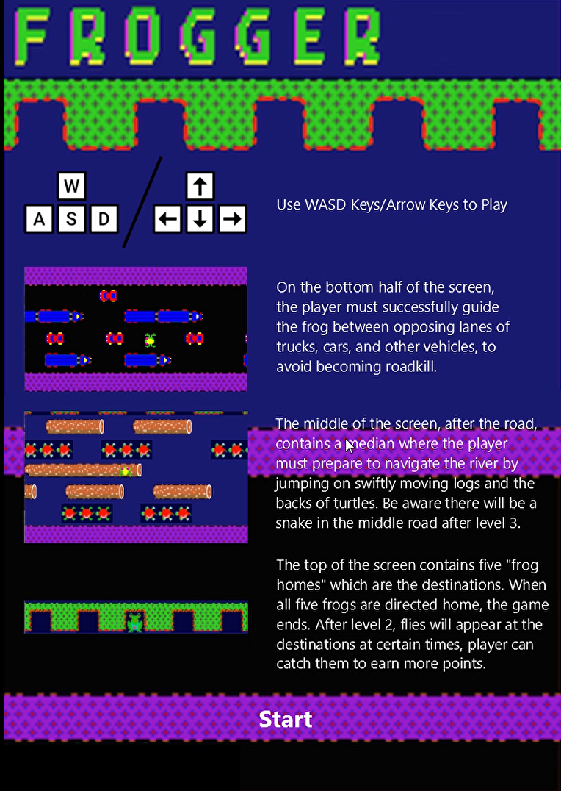

#### End Scene with High Score List:
* the end scene shows when the game is over
* Related Class Name: EndScene, EndSceneModel, EndSceneView, EndSceneController, ScoreList
* contains: 
			 1. winning/losing message
			 2. the score of the player gets in that round
			 3. a high scores list with corresponding player names (Only top 10 or less will be displayed)
			 4. two buttons: Play Again and Quit
* ScoreList class is to store and read the score(s) to/from a text file called Score.txt
 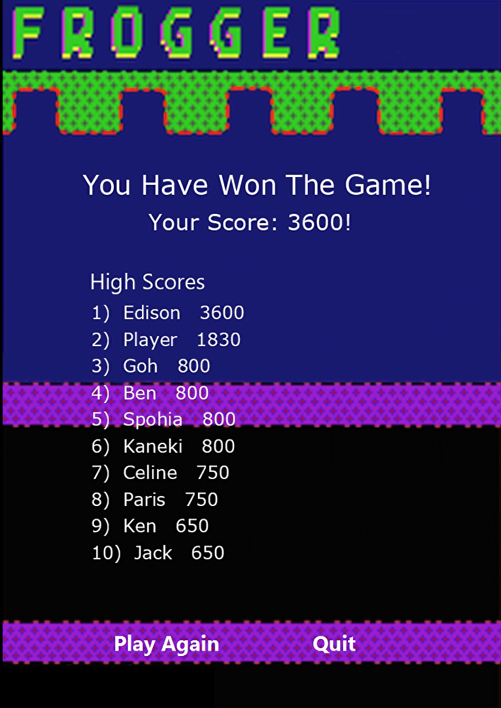
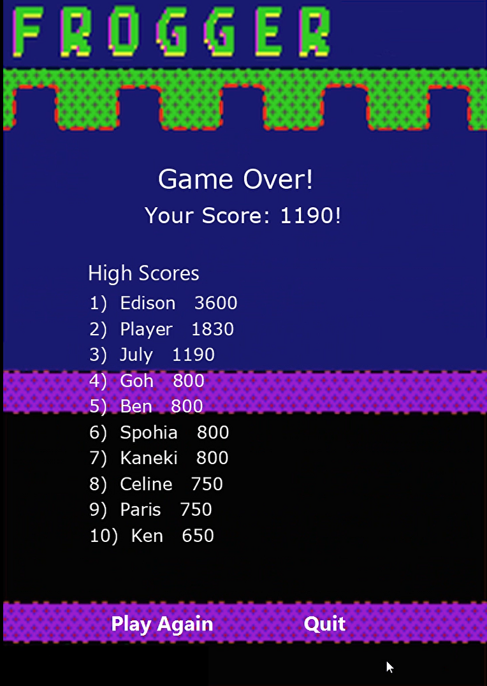

#### Game Section && its Levels:
* Related Class Name: Game, GameModel, GameView, GameController, Levels, Level1, Level2, Level3, Level3, Level4, Level5, Fly, GameLife, Snake
* Levels:
		 Level 1: Normal actors with normal speed
		 Level 2: Added five game lives
		 Level 3: Added the fly in the frog's destination
		 Level 4: Added a snake on the middle road
		 Level 5: Increased the speed
* Game class indicates the game section which has levels including level 1,2,3,4,5.
 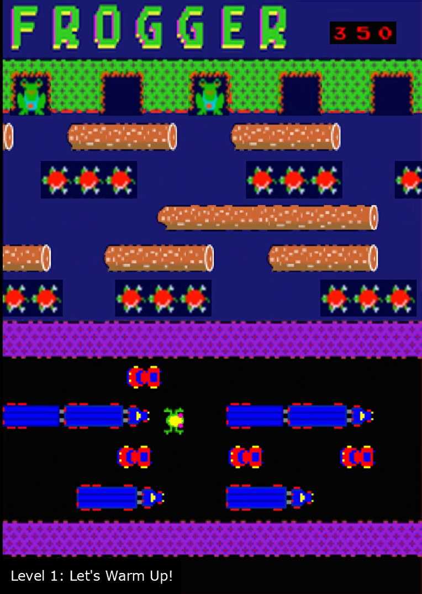
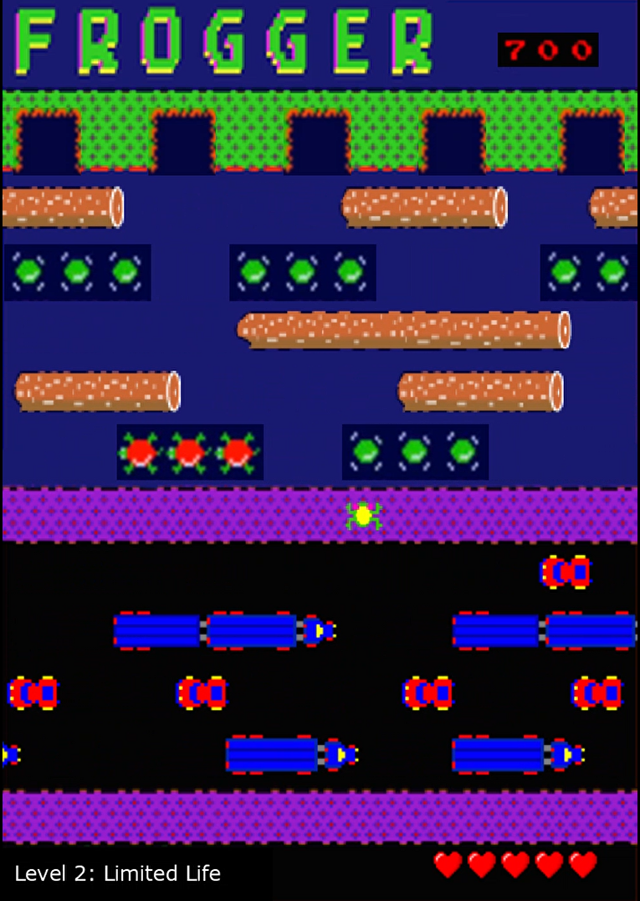
 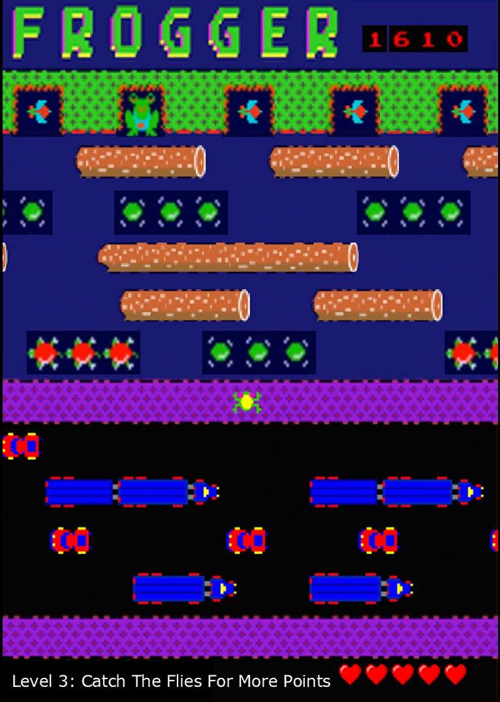
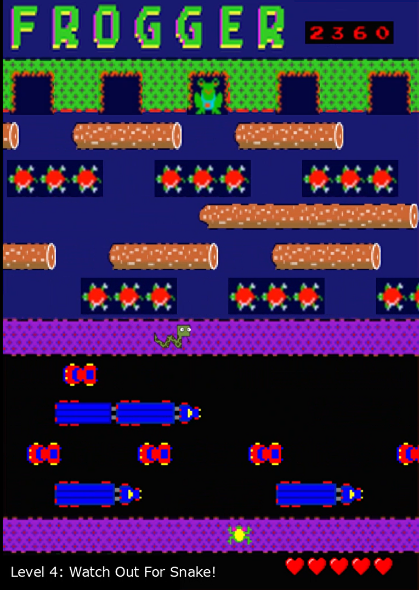
 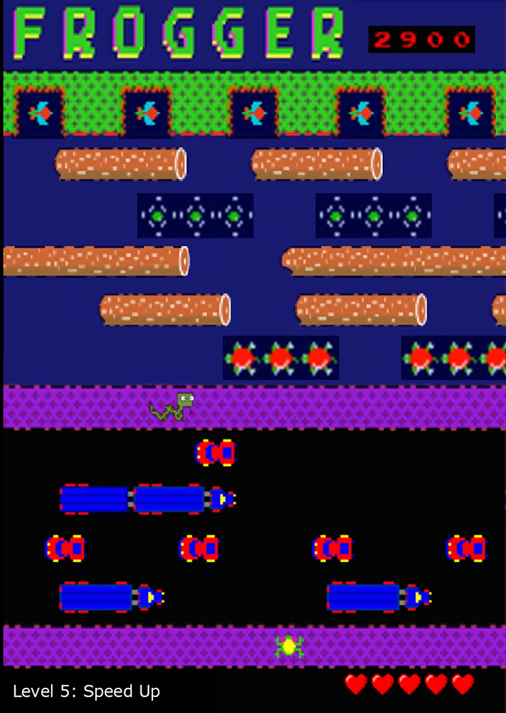

#### Game controls
* add one more option, the arrow keys, to play game instead of just using WASD keys
 
## Git Use
----
 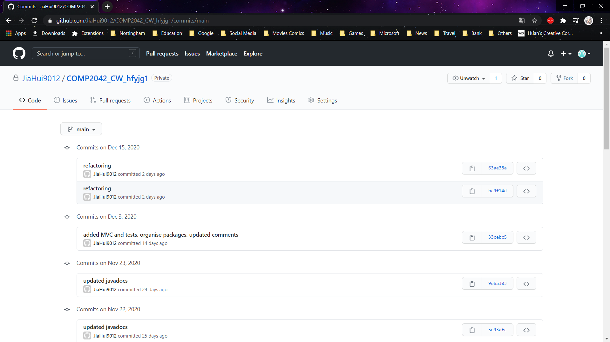
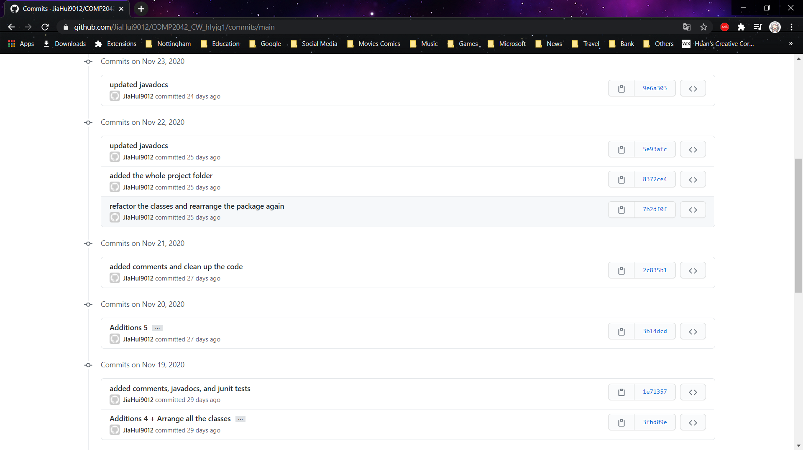
 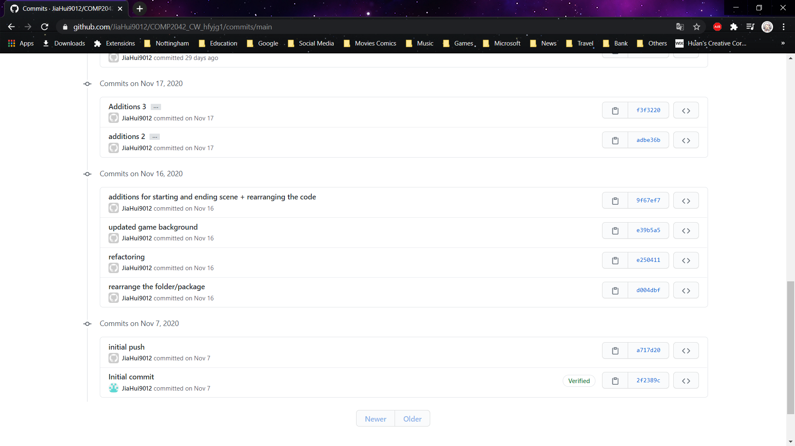

## Remarks
----
* Comments are added in the codes and Javadocs are generated into the project.